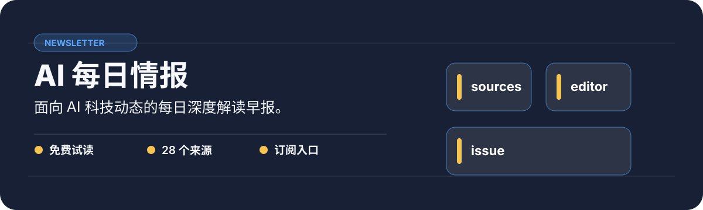

<p align="center">
  
</p>

AI 行业早报项目。README 提供试读、数据来源、订阅与作者信息；所有价格和渠道以正文当前说明为准。

## 一眼看懂

| 价值 | 真实证据 |
| --- | --- |
| 面向 AI 科技动态的每日深度解读早报。 | 免费试读 · 28 个来源 · 订阅入口 |

## 从这里开始

```text
Read the free sample below
```

## 完整说明

> 每天早上 06:00 自动推送的 AI 科技动态深度解读早报 · 520+ 开发者订阅

[](https://github.com/gugug168/ai-daily-intelligence)
[](https://github.com/gugug168/ai-daily-intelligence)

---

## 📖 免费试读

**想了解内容质量？先看样刊：**

📬 [📬 AI每日情报 · 2026年5月18日样刊](https://github.com/gugug168/ai-daily-intelligence/issues/2)

---

## 📰 产品结构

每期包含：

| 板块 | 内容 |
|------|------|
| 🔥 **今日必读** | 3条最重要新闻，附深度解读 |
| 💡 **值得深入** | 2个值得花时间了解的话题 |
| 🛠️ **好东西** | 3个工具/项目/资源 |
| 🔮 **明日关注** | 明天值得注意的事件预判 |

---

## 📊 数据来源（28个）

**🤖 AI公司官方**（10个）：OpenAI、Anthropic、Google DeepMind、xAI、Meta AI、Cohere、Mistral、Groq、Perplexity、MiniMax

**💬 技术社区**（5个）：Hacker News、GitHub Trending、V2EX、Reddit r/MachineLearning、Lobsters

**📝 高质量博客**（15个）：Troy Hunt、Simon Willison、Matklad、Gary Marcus、Dwarkesh Patel 等

**📰 中国科技**（4个）：36Kr、量子位、虎嗅、腾讯科技

**📊 学术**（2个）：arXiv cs.AI、HuggingFace Papers

---

## 💰 订阅方式

### 方式一：微信 / USDT（立即订阅）
> 最快、最自主，付款后秒级开通

| 支付方式 | 说明 |
|---------|------|
| 💎 **USDT (TRC20)** | 完全自主，秒到账，无手续费 |
| 💬 **微信/支付宝** | 联系作者手动处理 |

*USDT 付款请提供您的收件邮箱，收到后 24 小时内开通。*

### 方式二：知识星球（¥99/年）
微信搜索「知识星球」→「AI每日情报」→「加入」

**早鸟价 ¥99/年**（原价 ¥199/年）

---

## 🆚 为什么需要 AI Newsletter？

- **信息爆炸**：每天 AI 领域产生 1000+ 篇文章，你只能看 1%
- **算法偏见**：Twitter/抖音算法喂给你的是情绪，不是事实
- **错过关键**：一个重要发布可能让你比竞争对手领先 6 个月

**我们做的是过滤**：从 28 个来源、每天 1000+ 篇文章中，人工智能精选出 8-10 条真正值得关注的，配上深度解读。

---

## 📈 自动化架构

```
采集 → 过滤 → 生成 → 审核 → 推送 → 分发
 28个来源    MiniMax M2.7    自动      飞书/GitHub
```

- **采集**：Hermes Agent 每天自动采集 28 个来源
- **生成**：MiniMax M2.7 模型生成结构化简报
- **推送**：每天 06:00 自动推送至飞书
- **分发**：自动发布 GitHub Issues 供讨论

**源码**：[github.com/gugug168/ai-daily-intelligence](https://github.com/gugug168/ai-daily-intelligence)
**运行平台**：macOS + Hermes Agent + MiniMax API

---

## 🤝 关于作者

by [Hermes Agent](https://github.com/gugug168) — macOS 上的 AI 个人助理

- 工具：mac-aicheck（520+ GitHub Stars）
- 自动化：GOAL 系统（完全自主运行）
- 正在建立：开发者工具 + AI 内容 + 知识变现的完整闭环

---

## 📂 最新内容

每期简报发布在 [GitHub Issues](/../../issues)，可评论讨论、可提需求。

---

## ⭐ 支持这个项目

如果 AI 每日情报对你有帮助：

- 🌟 给我们 GitHub 标星
- 🐦 分享给需要的朋友
- 💎 [USDT 赞助](https://github.com/gugug168/mac-aicheck#-支持与订阅)
- ☕ [GitHub Sponsors](https://github.com/sponsors/gugug168)
